对个人用户来说，建站最快方式就是使用赛博菩萨提供的[Pages](https://pages.cloudflare.com/)。只需要在界面简单的点击几下，就能快速的部署一个静态网站，而且每天提供 10W 次免费请求额度，对个人用户真就是”白嫖“。

再加上其强大的 DNS，在全球任意一个地方基本上都能实现毫秒级访问。而且如果你有域名，还能设置自己的专属域名。

<!-- truncate -->

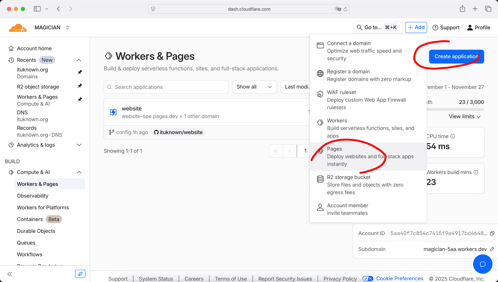

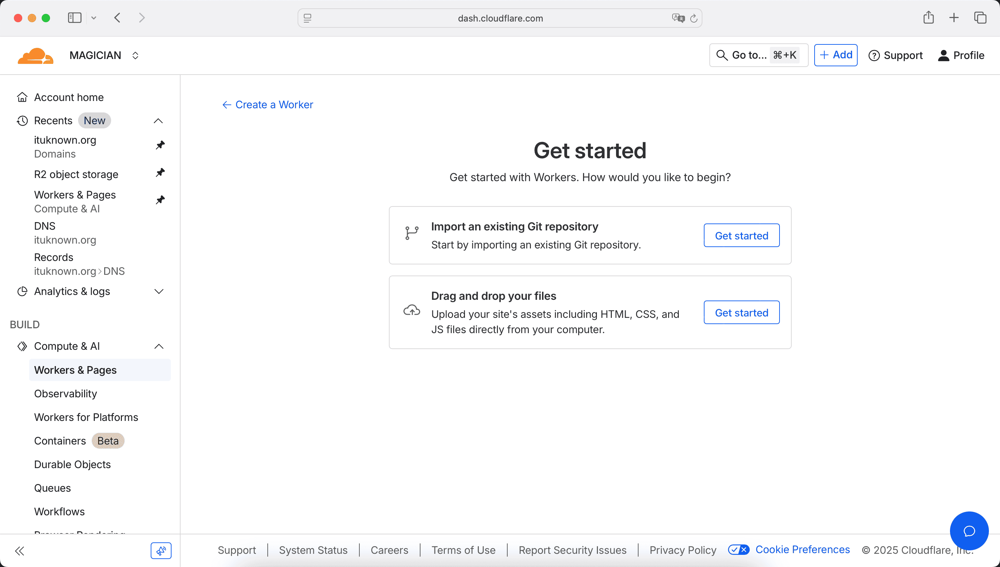

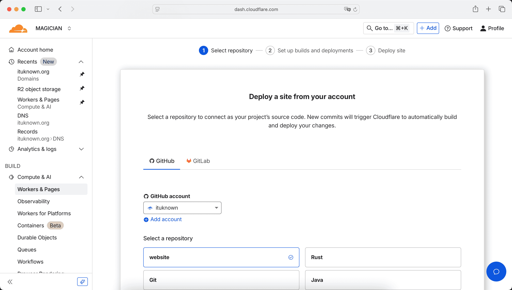

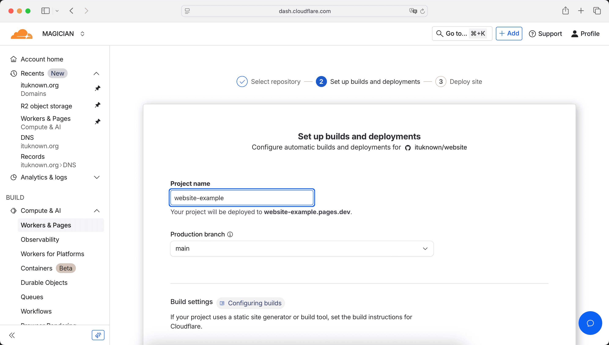

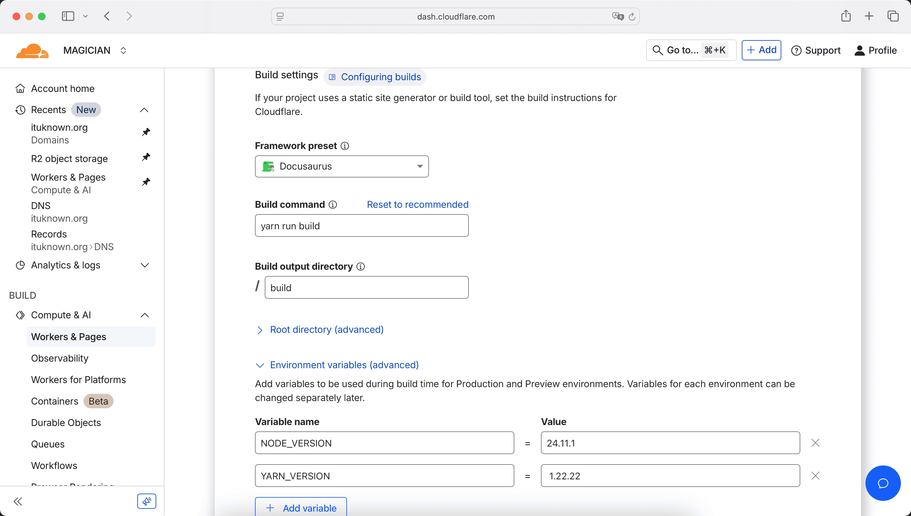

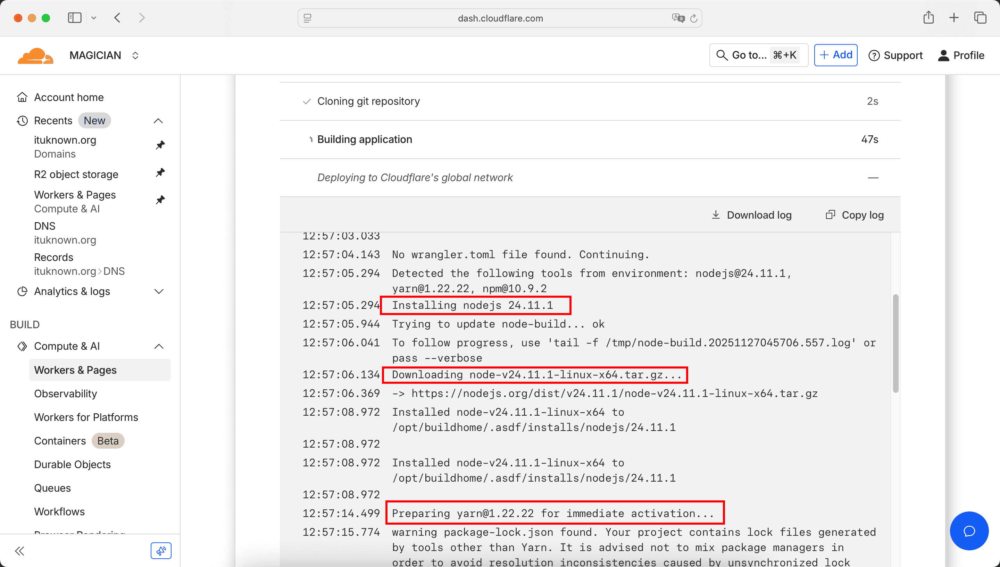

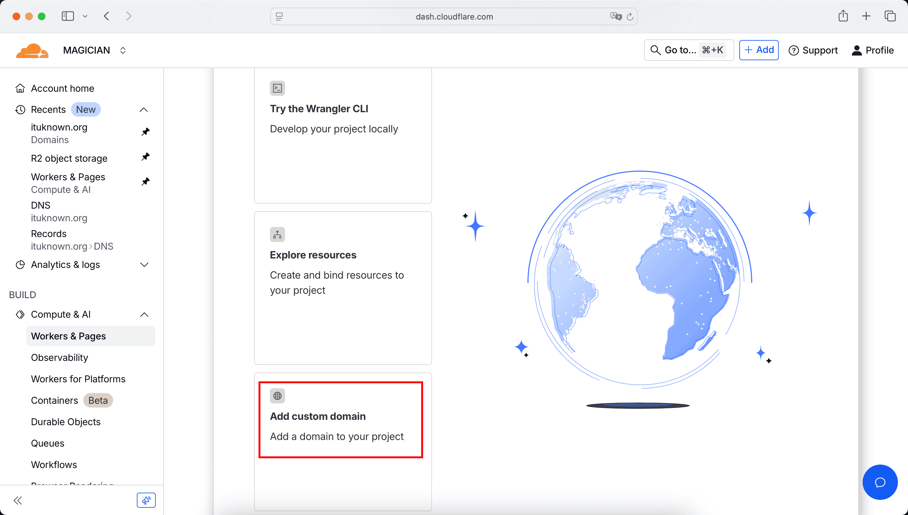

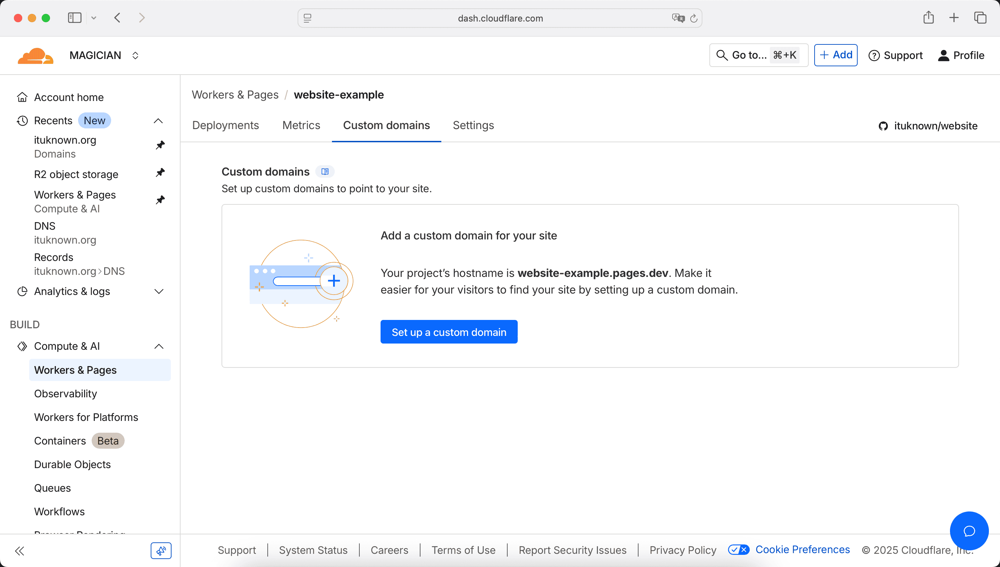

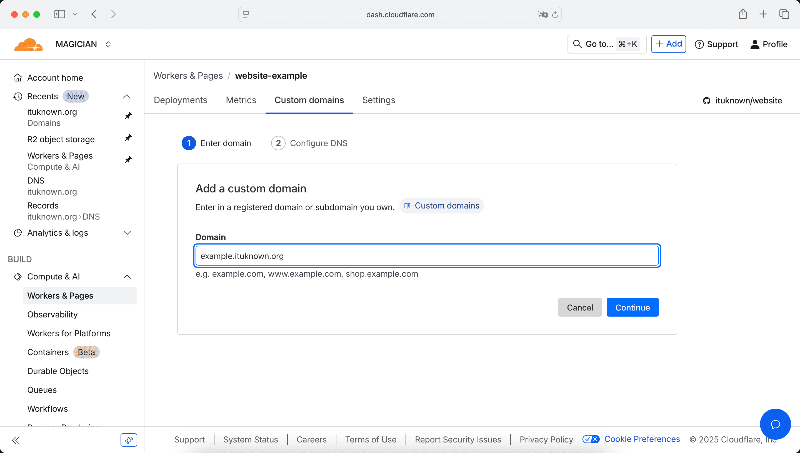

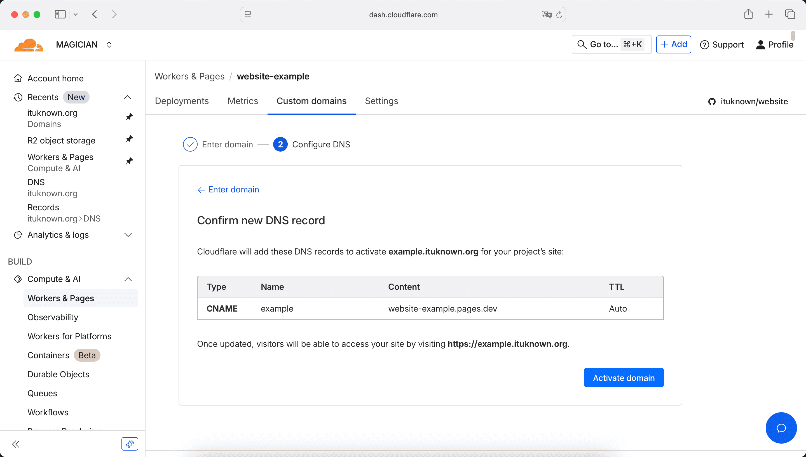

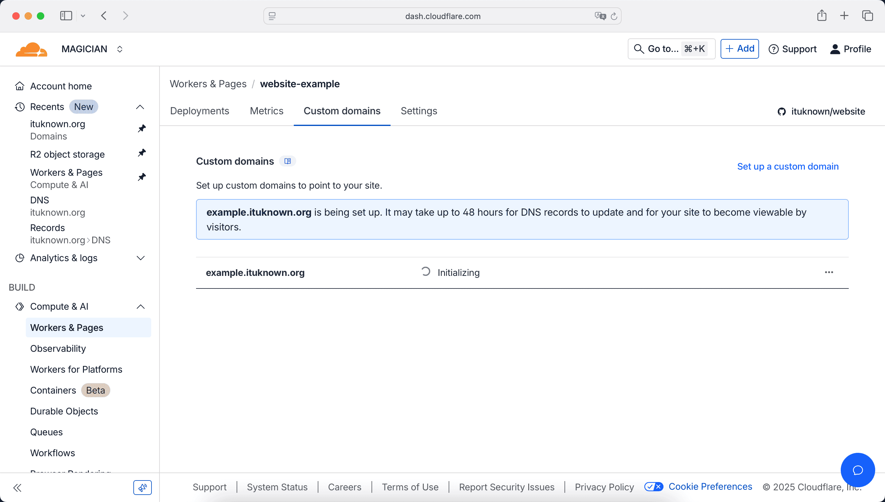

:::info[域名验证]

当自定义域名初始化完成之后，会进入 Verifying 阶段。如果你的域名是在 CloudFlare 上注册的（或已迁移到 CloudFlare），到这一步什么都不需要操作，CloudFlare 会自定执行验证。

但如果你的自定义域名还未迁移到 CloudFlare，此时需要按照下面的提示进入到你的域名服务商平台的管理页面，在域名 DNS 解析中添加一条 CNAME 记录。填写完成之后点击 **Check DNS Records**，如果信息无误，就完成激活验证了。

:::

当激活成功之后就可以使用你的自定义域名访问网站了：

