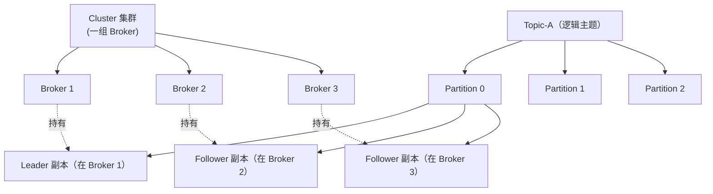
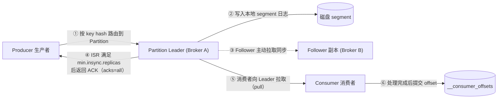
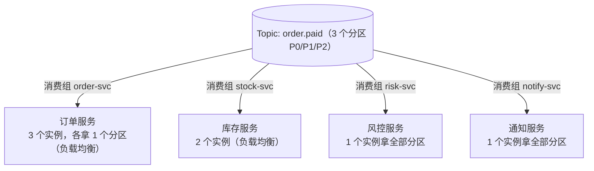

## 一句话理解

> **Broker 是机器，Topic 是分类，Partition 是真正存数据的地方，Replica 是 Partition 的备份；生产者往 Topic 里写，消费者按组从 Topic 里读。**

理解 Kafka，本质上就是理解这一组概念的**层次关系**和**数据如何在它们之间流动**。本文先讲清层次与关系，再讲数据流转，再讲容量规划、消费者组设计，最后讲故障处理。

## 整体架构与层次关系

Kafka 的概念可以分成「逻辑层」和「物理层」两层来看：



从上到下的层次是：

**Cluster（集群）** → **Broker（节点）** → **Topic（主题，逻辑）** → **Partition（分区，物理）** → **Replica（副本：Leader / Follower）**

### Cluster：集群

一组 Broker 组成的逻辑集合，共享同一份集群元数据（在 KRaft 模式下由 controller 节点维护，Kafka 4.x 已移除 ZooKeeper）。对外是一个整体，客户端连接任意一个 Broker 都能拿到整个集群的元信息。

### Broker：节点

一个 Broker 就是一个 Kafka 服务进程（通常一台机器一个）。它负责：

* 存储数据（分区副本落在它的磁盘上）；
* 处理生产者写入、消费者拉取请求；
* 维护自己作为 Leader 的分区的读写、作为 Follower 的分区的同步。

集群里有几个 Broker，就决定了**容量上限**和**容错能力**。

### Topic：主题（逻辑层）

Topic 是面向业务的逻辑分类，类似于「消息频道」。生产者往某个 Topic 发消息，消费者从某个 Topic 收消息。

:::tip[关键认知]
**Topic 是逻辑概念，本身不存数据。** 数据真正落地在它的 Partition 上。你可以把 Topic 理解成「一类消息的集合」，而 Partition 才是磁盘上那个真实的日志文件。
:::

### Partition：分区（物理层）

每个 Topic 由 1 到 N 个 Partition 组成。**Partition 才是 Kafka 真正的存储和并行单元**：

* 每个 Partition 是一个**有序、不可变、持续追加**的消息日志（由多个 segment 文件组成）；
* 同一个 Partition 内，消息是**严格有序**的；**跨 Partition 没有全局顺序**；
* Partition 数 = 这个 Topic 在单个消费者组内的**最大消费并发数**。

Partition 分布在集群的不同 Broker 上，这就是 Kafka 横向扩展吞吐的方式。

### Replica：副本（Leader / Follower / ISR）

为了保证高可用，每个 Partition 可以有多个副本，副本数由 `replication-factor` 决定：

* **Leader 副本**：该分区的「主管」，**所有读写请求都走 Leader**；
* **Follower 副本**：被动地**从 Leader 拉取（pull）数据**做同步，不直接服务客户端；
* **ISR（In-Sync Replicas）**：与 Leader 保持「足够同步」的副本集合（含 Leader 自己）。Leader 出问题时，新 Leader **只能从 ISR 里选**（默认配置下）。

:::danger[铁律]
**同一个 Partition 的不同副本，必须分布在不同的 Broker 上。** 否则一台机器挂了，整个分区的所有副本都没了，数据就真丢了。这也是 `replication-factor` 不能超过 Broker 数量的原因。
:::

### 它们如何相互影响

| 变化 | 影响 |
| --- | --- |
| 增加 Broker | 可承载更多副本、提升集群吞吐与存储、提升容错 |
| 增加 Partition | 提升单 Topic 并发与吞吐，但会增加 Leader 选举、元数据和文件句柄开销；**且会打乱 key 的分区路由** |
| 增加 replication-factor | 提升数据可靠性，但占用更多磁盘、增加同步开销 |
| Broker 宕机 | 其上的 Leader 分区会被重新选举，由其它 Broker 上的 Follower 顶上 |

更细的取舍（分区数怎么定、副本数怎么选）可以参考：[Topic 最佳实践](Topic%20最佳实践.md)。

## 数据流转全过程

下图是一次完整的「生产 → 存储 → 消费」端到端流转：



### 生产者投递过程

1. **序列化与分区路由**：生产者把消息序列化后，根据消息 **key** 计算哈希，决定写入哪个 Partition（key 相同 → 永远进同一个 Partition）；
2. **找到 Leader**：生产者从元数据中找到该 Partition 的 **Leader 所在 Broker**，只把请求发给 Leader；
3. **Leader 写日志**：Leader 把消息**追加**到本地 segment 日志文件；
4. **Follower 同步**：Follower 主动从 Leader **拉取**数据进行同步（注意是 pull，不是 Leader 推送）；
5. **ACK 确认**：根据生产者的 `acks` 配置决定何时返回成功：
   * `acks=0`：发出去就算成功，不等确认（最快、可能丢）；
   * `acks=1`：Leader 写入本地就返回（Leader 刚好挂了仍可能丢）；
   * `acks=all`（即 `-1`）：等待 **ISR 中所有副本**都同步完才返回（最可靠，配合 `min.insync.replicas` 使用）。

:::tip[可靠性黄金组合]
`replication-factor=3` + `min.insync.replicas=2` + 生产者 `acks=all` + 关闭 `unclean.leader.election.enable`。这样即使挂掉一台机器，消息也不会丢。
:::

### 消费者消费过程

1. **加入消费组**：消费者启动后向「组协调器（Group Coordinator，某个 Broker）」注册，加入一个消费者组；
2. **分区分配（Rebalance）**：协调器把 Topic 的 Partition **分配**给组内的各个消费者；
3. **拉取消费**：消费者**主动向自己分到的 Partition 的 Leader 拉取**消息（同样是 pull 模型）；
4. **提交 offset**：消费处理后，把「消费到哪了」的进度（offset）提交到内部 Topic `__consumer_offsets`，下次能接着消费。

:::danger[又一个铁律]
**在同一个消费者组内，一个 Partition 同一时刻只能被一个消费者消费。** 所以一个消费者组内的有效并发数，上限就是 Partition 数。消费者实例数 > 分区数时，多出来的实例只会**空转**。
:::

## 每个节点如何合理创建

「合理创建」其实就是做**容量与拓扑规划**，每一层都有自己的原则：

### Cluster（集群规模）

* 生产环境**至少 3 个节点**。KRaft 模式下 controller 选举依赖多数派（quorum），3 个才能容忍 1 个宕机；
* 节点数要满足：容错需求 + 副本分布（`replication-factor` ≤ Broker 数）+ 预估的吞吐/存储负载。

集群搭建见：[集群部署](集群部署.md)。

### Broker（单节点）

* 单 Broker 的磁盘、网卡、内存决定了它的承载上限；
* Broker 数量 × 单机能力 = 集群总能力，规划时留足**余量**，避免单点过载。

### Topic

* 按**业务域 / 事件**划分，一个 Topic 只承载一类语义的消息；
* 命名要带业务含义，推荐格式：`{业务域}.{事件名}[.版本]`，如 `order.paid`、`user.profile_updated.v1`；
* **不要给每个用户/租户单独建 Topic**，会让 broker「目录爆炸」。

### Partition（分区数）

分区数一旦确定就**不建议频繁改**（加分区会打乱 key 路由、触发 rebalance）。提前按以下方式估算（详见 [Topic 最佳实践](Topic%20最佳实践.md)）：

* 按 QPS：单分区约支撑 2k–10k QPS；
* 按消费者并发：分区数 ≥ 最忙消费者组期望的并发线程数；
* 按吞吐：`分区数 ≈ 峰值总吞吐 / 单分区吞吐`（单分区约 1–10 MB/s）。

### Replica（副本与可靠性）

* 生产环境 `replication-factor=3`；
* `min.insync.replicas=2`（配合 `acks=all`）；
* 创建与参数详解见：[Topic 管理](Topic%20管理.md)。

## 消费者组与服务的关系

消费者组（Consumer Group）是 Kafka 实现「**一条消息，既可以负载均衡、又可以广播**」的核心机制。理解它，关键在于搞清**组与组之间、组内成员之间**两种截然不同的行为：



* **组与组之间 = 广播**：不同的消费组各自独立消费 Topic 的**全量**消息，互不干扰。上图中订单、库存、风控、通知四个服务**都能收到同一条 `order.paid`**；
* **组内成员之间 = 负载均衡**：同一个组里的多个消费者**瓜分**分区，每条消息只被组内**一个**消费者处理。

### 核心设计原则

> **一个独立的服务（或一类独立的消费逻辑）= 一个独立的消费组。**

每个消费组维护**自己独立的 offset**，互不影响消费进度，可以独立扩缩容、独立重置 offset。这就是「一份数据，多处消费」的实现方式。

### 微服务 / 多服务中如何合理设计消费组

以「订单支付成功」这个事件为例，下游通常有多个服务关心它：

| 服务 | 作用 | 消费组 | 实例数 |
| --- | --- | --- | --- |
| 订单服务 | 更新订单状态 | `order-svc` | 3（= 分区数，满并发） |
| 库存服务 | 扣减库存 | `stock-svc` | 2 |
| 风控服务 | 风控统计 | `risk-svc` | 1 |
| 通知服务 | 发短信/推送 | `notify-svc` | 1 |

设计要点：

1. **每个服务用各自的消费组**，这样某个服务重启/重置 offset/出故障，**不会影响其他服务**的消费进度；
2. **同一个服务的多个实例共用同一个消费组**，实现分摊消费。但**实例数不要超过分区数**，否则多余的实例永远分不到分区、白白空转；
3. **需要广播就用不同组**（如风控、通知都要全量数据）；**需要分摊就用同组多实例**（如订单服务高并发）。

### 消费组命名规范

消费组的 `group.id` 同样要有清晰、可读、带环境隔离的命名，推荐格式：

```
{环境}.{服务名}.{用途}
```

示例：

```
prod.order-svc.payment
prod.stock-svc.deduct
staging.order-svc.payment
```

:::danger[环境必须隔离]
**不同环境（dev / test / staging / prod）一定要用不同的 `group.id`**。否则测试环境的消费者会和生产环境**抢同一个分区的消息**，导致生产数据被「偷走」消费。
:::

## 常见故障与排查处理

### Broker 宕机 / Leader 切换

**现象**：某个 Broker 挂掉，它上面的 Leader 分区不可用。

**Kafka 的自愈**：controller 会从该分区的 **ISR** 中重新选出一个 Follower 作为新 Leader，读写恢复。

**处理建议**：

* 关闭 `unclean.leader.election.enable`（默认已关闭），避免选一个没同步完的副本当 Leader 而丢数据；
* 重启宕机节点后，它会追平数据、重新加入 ISR，但不自动恢复为 Leader —— 可定期做 **preferred leader election** 让 Leader 分布重新均衡；
* 若宕机导致 ISR < `min.insync.replicas`，`acks=all` 的写入会**直接失败**（这是预期行为，宁可失败不可丢数据）。

### 消息丢失

| 环节 | 防丢手段 |
| --- | --- |
| 生产端 | `acks=all` + `min.insync.replicas≥2` + `replication-factor=3` + 关闭 unclean leader 选举 |
| Broker 端 | 副本数足够、副本分布在不同 Broker |
| 消费端 | 关闭自动提交（`enable.auto.commit=false`），**处理完业务再手动提交 offset** |

### 消息重复

* **生产端**：开启幂等生产 `enable.idempotence=true`；需要跨分区原子写入时用事务（`transactional.id`）实现 exactly-once；
* **消费端**：消费逻辑做**业务幂等**（基于唯一键/业务 ID 去重），这是最稳的兜底。

### 消息乱序

* **跨分区本就无序**；要保序就把需要保序的消息用**相同的 key**（如订单号），让它们进同一个分区；
* 生产端开启 retries 时，若 `max.in.flight.requests.per.connection > 1` 可能导致同分区内重排 —— 开启**幂等生产**即可解决。

### 消费者频繁 Rebalance（消费抖动）

**现象**：消费者进进出出导致 rebalance 频繁，消费暂停、甚至反复重置。

**处理**：

* 适当增大 `session.timeout.ms` 和心跳间隔，避免网络抖动误判下线；
* 使用 **cooperative sticky** 分配器（`partition.assignment.strategy`），减少「全员大洗牌」；
* 对稳定实例使用**静态成员**（`group.instance.id`），重启不触发 rebalance。

### 消息积压（Lag）

**现象**：消费速度跟不上生产，消费滞后越来越大。

**处理**：

* 先**增加消费者实例**（前提：实例数 ≤ 分区数还有空间）；
* 优化消费逻辑本身（批量、异步、减少单条耗时）；
* 若分区数本身不够、且业务**允许**打乱 key 顺序，再考虑**扩容分区**；
* 紧急情况下可临时加机器只做「消费搬运」先把积压消化掉。

### 分区 Leader 倾斜

**现象**：Leader 集中在少数 Broker 上，负载不均。

**处理**：执行 **preferred leader election**，让各分区的「首选 Leader」重新上岗，使 Leader 在 Broker 间均匀分布。建议配合监控定期触发。

### 磁盘 / 容量问题

**现象**：磁盘占用持续上涨甚至写满。

**处理**：

* 复核 `retention.ms` / `retention.bytes` 是否设置过保守（详见 [Topic 管理](Topic%20管理.md)）；
* 扩容 Broker 或迁移分区；
* 排查是否有「无谓消息」（重复事件、超大 payload），从源头减少写入。
